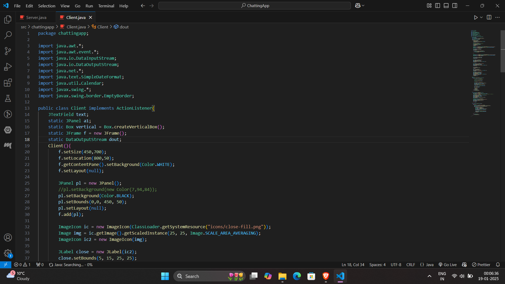
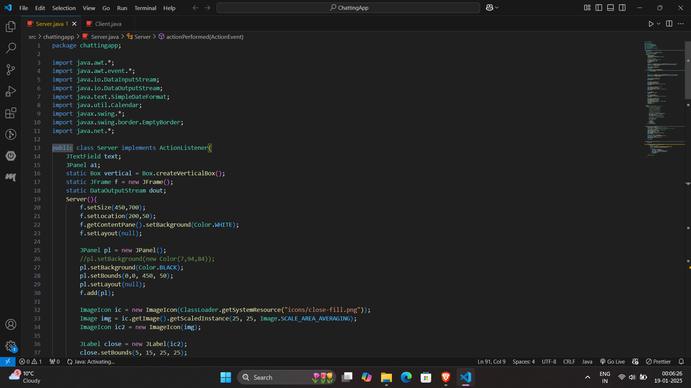
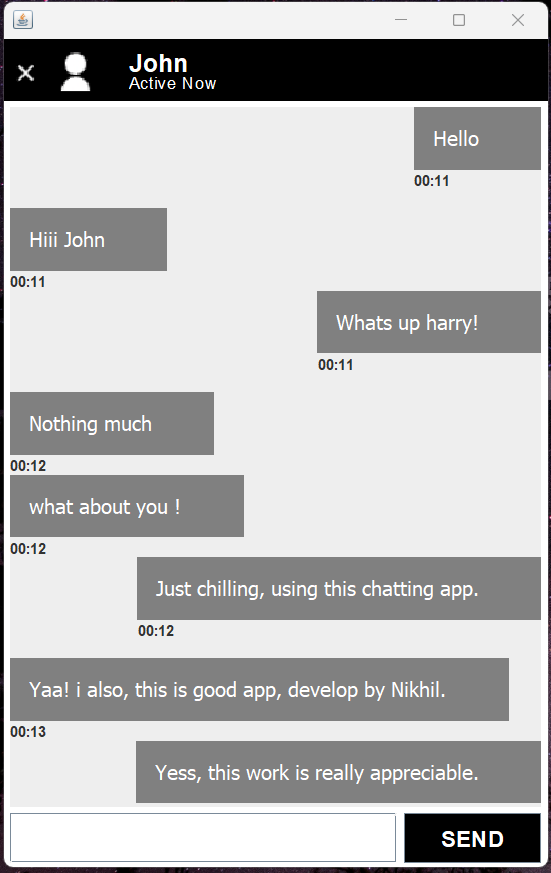
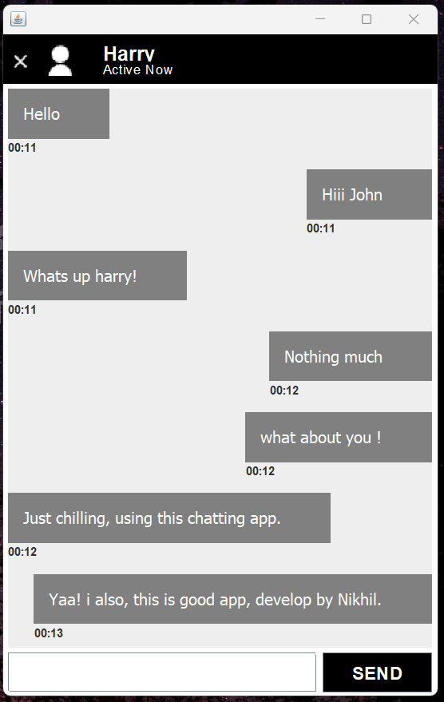

# **ChatSpace - Real-Time Chat Application**  

## **Overview**  
ChatSpace is a simple, real-time chat application built using **Java** and **Swing** with a client-server architecture. It provides an intuitive GUI for seamless text-based communication between users. The project is an excellent demonstration of socket programming and GUI design skills in Java.  

---

## **Features**  
- **Real-Time Messaging**: Communicate instantly between client and server.  
- **User-Friendly Interface**: Designed with Java Swing for a clean and functional GUI.  
- **Dynamic Chat Display**: Displays messages with timestamps for easy tracking.  
- **Status Indicator**: Shows active status of the user in the application.  
- **Lightweight & Efficient**: Handles message delivery using sockets and multithreading for optimal performance.  

---

## **Technologies Used**  
- **Java**: Core language for building the application.  
- **Swing**: GUI framework for creating the application interface.  
- **Socket Programming**: Establishing reliable communication between client and server.  

---

## **Setup and Installation**  
### **Prerequisites**  
- Java Development Kit (JDK) installed.  
- An IDE like IntelliJ IDEA, Eclipse, or NetBeans.  

### **Steps to Run**  
1. Clone this repository:  
   ```bash  
   git clone https://github.com/YourUsername/ChatSpace.git  
   ```  
2. Open the project in your preferred IDE.  
3. Compile and run the **Server.java** file first to start the server.  
4. Compile and run the **Client.java** file to connect to the server.  
5. Start chatting! 🎉  

---

## **Screenshots**  
1. **Client Window**  
     

2. **Server Window**  
   

3. **Chatting Screenshot**
   - Server side:
   

   - Client side:
   

---

## **Learning Outcomes**  
- Mastered **socket programming** for real-time communication.  
- Gained experience in building GUIs with **Java Swing**.  
- Improved understanding of **multithreading** and event-driven programming.  

---

## **Future Enhancements**  
- Adding support for multiple clients using threads.  
- Incorporating file-sharing capabilities.  
- Introducing an encryption layer for secure communication.  

---

## **Contributions**  
Contributions are welcome! Feel free to fork this repository and submit pull requests for enhancements or bug fixes.  

---

## **License**  
This project is licensed under the MIT License.  

---

## **Contact**  
For any queries or suggestions:  
- **Email**: [nikhilkeshri2213@gmail.com](nikhilkeshri2213@gmail.com)  
- **GitHub**: [Your GitHub Profile](https://github.com/Nikhil-keshri2213)  
